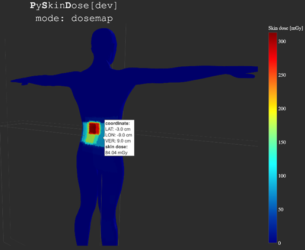

# What is PySkinDose?

PySkinDose is an open-source Python™ package for RDSR-irradiation event skin dose estimation. This system 
translates air kerma at the PERP to skin dose estimates for all directly irradiated surfaces on 
computational phantoms. The phantoms are oriented with the X-ray source by geometric parameters found within 
the RDSR, and conversion from air Kerma at the PERP to skin dose is further supported by correction factors 
found in literature, as well as a limited number of in-clinic measurements, e.g. validation of the coordinate 
system, table and pad transmission etc. The output of the software is an estimation of skin dose and an 
interactive visual indication of skin dose distribution mapped onto an anthropomorphic or a cylindrical 
phantom. The real position of the phantom on the tabletop can be taken into account. A variety 
of voxelized phantoms can be incorporated in PySkinDose.

