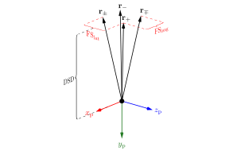
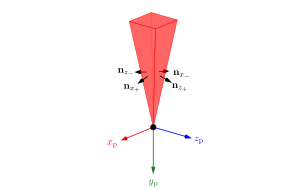
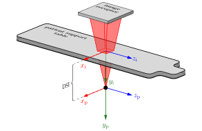
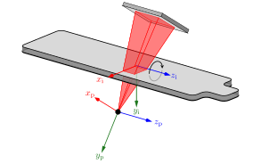
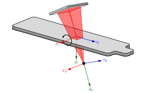
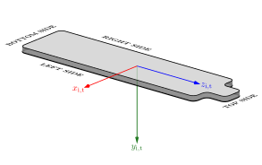
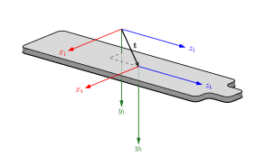
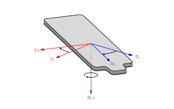
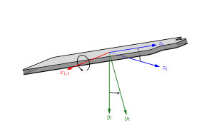
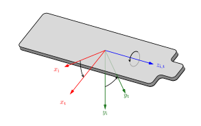

# Static plots

Welcome!

:::{figure,myclass} fig_beam_vectors

This is a caption in **Markdown** 
:::

:::{figure,myclass} fig_beam_normals

This is a caption in **Markdown** 
:::

:::{figure,myclass} fig_beam_standard

This is a caption in **Markdown** 
:::

[Go to the image!](fig_beam_standard)

:::{figure,myclass} fig_beam_ap1

This is a caption in **Markdown** 
:::

:::{figure,myclass} fig_beam_ap2

This is a caption in **Markdown** 
:::

:::{figure,myclass} fig_table_standard

This is a caption in **Markdown** 
:::

:::{figure,myclass} fig_table_translate

This is a caption in **Markdown** 
:::

:::{figure,myclass} fig_table_at1

This is a caption in **Markdown** 
:::

:::{figure,myclass} fig_table_at2

This is a caption in **Markdown** 
:::

:::{figure,myclass} fig_table_at3

This is a caption in **Markdown** 
:::

$$
   \begin{eqnarray}
      \mathbf{N}  & = & \begin{bmatrix}
                           \mathbf{n}_{x_+}\\
                           \mathbf{n}_{x_-}\\
                           \mathbf{n}_{z_+}\\
                           \mathbf{n}_{z_-}
                        \end{bmatrix}
                  & = & \begin{bmatrix}
                           \mathbf{r}_+ \times \mathbf{r}_\pm\\
                           \mathbf{r}_- \times \mathbf{r}_\mp\\
                           \mathbf{r}_\mp \times \mathbf{r}_+\\
                           \mathbf{r}_\pm \times \mathbf{r}_-
                        \end{bmatrix}
   \end{eqnarray}
$$

$$
   \begin{eqnarray}
      \mathbf{R}  & = & \begin{bmatrix}
                           r_{1, x} & r_{1, y} & r_{1,z} \\
                           r_{2, x} & r_{2, y} & r_{2,z} \\
                           \vdots   & \vdots   & \vdots  \\
                           r_{N, x} & r_{N, y} & r_{N,z}\\
                        \end{bmatrix}
   \end{eqnarray}
$$
